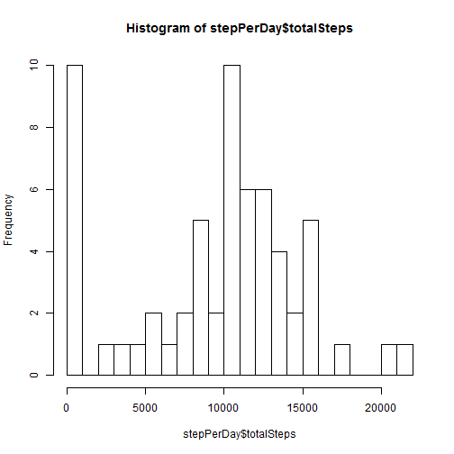
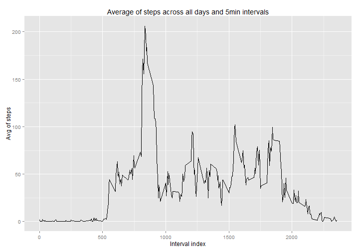
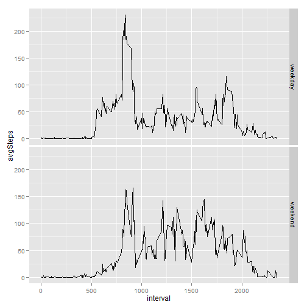
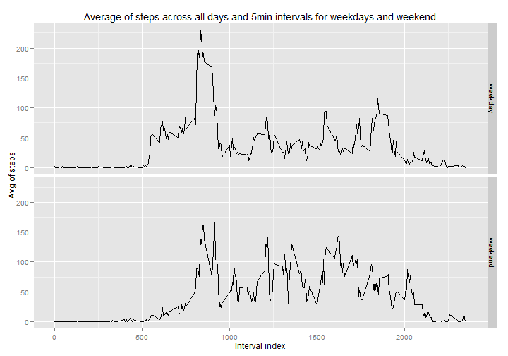

## Loading and preprocessing the data

```r
## List of essential packages
list <- c("dplyr", "ggplot2")
## Select those that are not installed
list <- list[!list %in% installed.packages()[, 1]]
## Install the missing packages.
if(length(list))
  lapply(list, install.packages, repos = "http://cran.us.r-project.org")

library(dplyr)
library(ggplot2)

## Open .csv file in .zip file
con <- unz("./activity.zip", "activity.csv")
## Read the data and transform into tbl_df
data <- tbl_df(read.csv(con, colClasses = c("numeric", "Date", "numeric")))
```

## What is mean total number of steps taken per day?

```r
## Group by date and summarise by sum without taking NA
stepPerDay <- data %>% group_by(date) %>% summarise(totalSteps = sum(steps, na.rm = TRUE))
qplot(totalSteps, data=stepPerDay, geom="histogram", 
      main="Total number of steps per day", xlab="Number of steps")
```

 

```r
meanStep<-mean(stepPerDay$totalSteps)
medianStep<-median(stepPerDay$totalSteps)
```
The steps per day average is 9354.2 and the median is 10395.0.

## What is the average daily activity pattern?

```r
## Group by interval and summarise by average without taking NA
stepPerInterval <- data %>% group_by(interval) %>% summarise(avgSteps = mean(steps, na.rm = TRUE))
qplot(stepPerInterval$interval, stepPerInterval$avgSteps, geom="line", 
      main="Average of steps across all days and 5min intervals", xlab="Interval index", ylab="Avg of steps")
```

 

```r
intervalIndexMaxStep<-stepPerInterval$interval[which.max(stepPerInterval$avgSteps)]
```
The interval index containing the maximum number of steps is 835.

## Imputing missing values

```r
## Counting NA
naNumber<-sum(is.na(data$steps))
```
The number of missing values is 2304.

We will now replace the NAs found in the original data by the average on every days for the same interval calculated in the previous step.

```r
## Replace NA by the average on every days for this interval
naRmData <- mutate(data, steps = ifelse(is.na(steps), stepPerInterval$avgSteps, steps))

## Group by day and summarise by sum without taking NA (which is useless here since NA have been replaced)
stepPerDay <- naRmData %>% group_by(date) %>% summarise(totalSteps = sum(steps, na.rm = FALSE))
qplot(totalSteps, data=stepPerDay, geom="histogram", 
      main="Total number of steps per day (with NA replaced)", xlab="Number of steps")
```

 

```r
meanStep1<-mean(stepPerDay$totalSteps)
medianStep1<-median(stepPerDay$totalSteps)
```
The steps per day average  (of the data with NA replaced) is 10766.2 and the median is 10766.2.

## Are there differences in activity patterns between weekdays and weekends?

```r
## Set LOCALS to get it right in english because I'm in Belgium and speeks french
Sys.setlocale("LC_TIME", "English")
```

```
## [1] "English_United States.1252"
```

```r
## Add weekday and weekend factor
naRmData <- mutate(naRmData, 
                   dayType = weekdays(date), 
                   dayType = as.factor(ifelse(dayType=="Sunday" | dayType=="Saturday", "weekend", "weekday")))

## Get my default LOCALS back
Sys.setlocale("LC_TIME","French_Belgium.1252")
```

```
## [1] "French_Belgium.1252"
```

```r
## Group by type of day and interval
stepPerInterval<- naRmData %>% group_by(dayType, interval) %>% summarise(avgSteps = mean(steps))

qplot(interval, avgSteps, data = stepPerInterval, geom = "line", facets = dayType ~ .,
      main="Average of steps across all days and 5min intervals for weekdays and weekend", 
      xlab="Interval index", ylab="Avg of steps")
```

 

Generated html by knit2html("PA1_template.Rmd")
