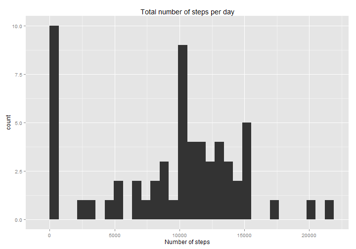
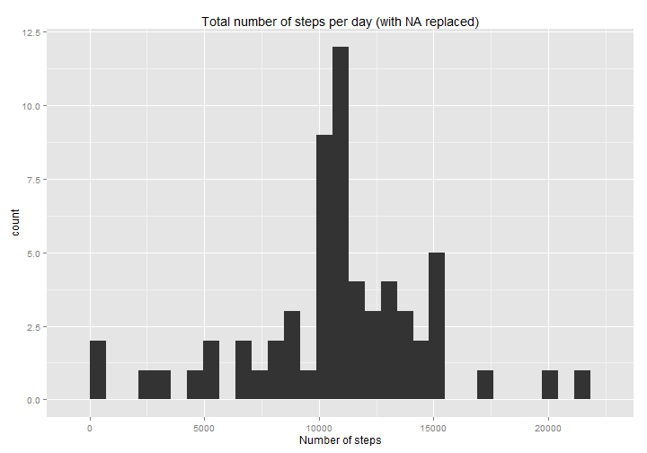

## Loading and preprocessing the data

```r
library(dplyr)
## Open .csv file in .zip file
con <- unz("./activity.zip", "activity.csv")
## Read the data
data <- tbl_df(read.csv(con, colClasses = c("numeric", "Date", "numeric")))
```

## What is mean total number of steps taken per day?

```r
## Group by date and summarise by sum without taking NA
stepPerDay <- data %>% group_by(date) %>% summarise(totalSteps = sum(steps, na.rm = TRUE))
hist(stepPerDay$totalSteps, breaks = 20)
```

 

```r
mean(stepPerDay$totalSteps)
```

```
## [1] 9354.23
```

```r
median(stepPerDay$totalSteps)
```

```
## [1] 10395
```

## What is the average daily activity pattern?

```r
## Group by interval and summarise by average without taking NA
stepPerInterval <- data %>% group_by(interval) %>% summarise(avgSteps = mean(steps, na.rm = TRUE))
plot(stepPerInterval$interval, stepPerInterval$avgSteps, "l")
```

 

```r
stepPerInterval$interval[which.max(stepPerInterval$avgSteps)]
```

```
## [1] 835
```

## Imputing missing values

```r
## Counting NA
sum(is.na(data$steps))
```

```
## [1] 2304
```

```r
## Replace NA by the average on every days for this interval
paddedData <- mutate(data, steps = ifelse(is.na(steps), stepPerInterval$avgSteps, steps))

## Group by day and summarise by sum without taking NA (which is useless here since NA have been replaced)
stepPerDay <- paddedData %>% group_by(date) %>% summarise(totalSteps = sum(steps, na.rm = FALSE))
hist(stepPerDay$totalSteps, breaks = 20)
```

 

```r
mean(stepPerDay$totalSteps)
```

```
## [1] 10766.19
```

```r
median(stepPerDay$totalSteps)
```

```
## [1] 10766.19
```

## Are there differences in activity patterns between weekdays and weekends?

```r
## Set LOCALS to get it right in english because I'm in Belgium and speeks french
Sys.setlocale("LC_TIME", "English")
```

```
## [1] "English_United States.1252"
```

```r
## Add weekday ans weekend factor
paddedData <- mutate(paddedData, dayType = weekdays(date), dayType = as.factor(ifelse(dayType=="Sunday" | dayType=="Saturday", "weekend", "weekday")))

## Get my default LOCALS back
Sys.setlocale("LC_TIME","French_Belgium.1252")
```

```
## [1] "French_Belgium.1252"
```

```r
## Group by type of day ans interval
stepPerInterval<- paddedData %>% group_by(dayType, interval) %>% summarise(avgSteps = mean(steps))

library(ggplot2)
qplot(interval, avgSteps, data = stepPerInterval, geom = "line", facets = dayType ~ .)
```

 

Generate html by knit2html("PA1_template.Rmd")
